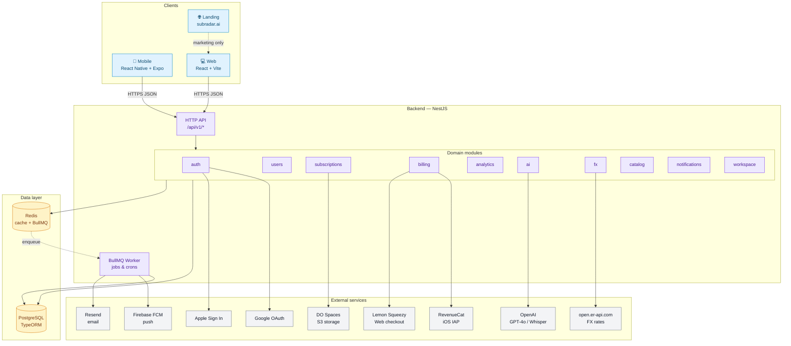
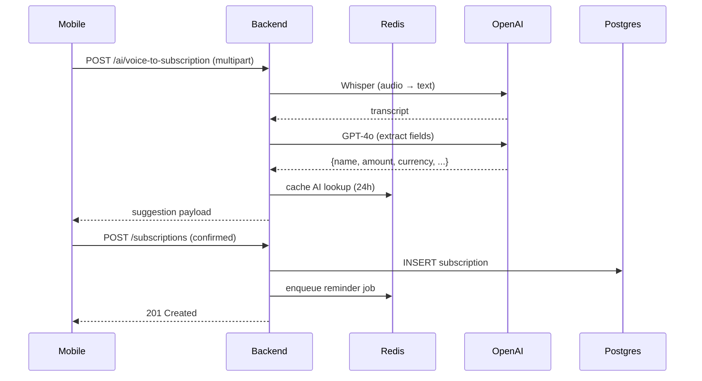

# SubRadar Architecture

High-level architecture of the SubRadar platform: clients, backend services, data stores, external integrations, and async processing.

## System diagram

## Components

### Clients
- **Mobile** — React Native + Expo SDK 54. iOS + Android. Talks to backend via REST (`/api/v1`). Uses RevenueCat native SDK for IAP. Bundle ID `io.subradar.mobile`.
- **Web** — React + Vite SPA hosted on `app.subradar.ai`. Uses Lemon Squeezy Checkout for payments.
- **Landing** — Static marketing site at `subradar.ai`. No app logic.

### Backend (NestJS)
Single monorepo NestJS app deployed as a Docker container. Global prefix `/api/v1`. Swagger docs at `/api/docs` (dev only).

| Module | Responsibility |
|--------|----------------|
| `auth` | JWT issue/refresh, Google OAuth, Apple Sign In, Magic Link email, mobile token aliases |
| `users` | Profile (`/users/me`), FCM token, display currency/region |
| `subscriptions` | CRUD, cancel/pause/restore, receipts upload |
| `billing` | RevenueCat sync, Lemon Squeezy webhooks, plan gating (Free / Pro / Team) |
| `analytics` | Summary, monthly chart, by-category, by-card, upcoming |
| `ai` | `/ai/lookup`, `/ai/parse-screenshot`, `/ai/voice-to-subscription`, `/ai/suggest-cancel` (GPT-4o + Whisper) |
| `fx` | Cached FX rates via `open.er-api.com` with in-process fallback table |
| `catalog` | Curated directory of known subscription services (name, logo, plans) |
| `notifications` | Reminder scheduling, BullMQ enqueue, FCM + Resend delivery, per-user preferences |
| `workspace` | Team plans: invitations, members, seat assignment |

### Async / background
- **BullMQ worker** runs in-process (same container) subscribed to Redis queues:
  - `reminders` — daily at 09:00 user-local TZ, scans upcoming renewals
  - `weekly-digest` — Monday mornings for Pro users
  - `fx-refresh` — hourly, refresh cached FX rates
  - `ai-audit` — async post-processing for low-confidence AI results
  - `billing-reconcile` — nightly sync with RevenueCat / Lemon Squeezy

### Data stores
- **PostgreSQL** (DigitalOcean Managed) — primary store, TypeORM migrations run on container start. 7-day automated backups.
- **Redis** — BullMQ queues + short-lived caches (FX rates, AI lookup, magic-link tokens).

### External integrations
- **RevenueCat** — iOS In-App Purchases. Backend validates customer info via REST API.
- **Lemon Squeezy** — Web subscriptions. Webhook at `/api/v1/billing/webhook` (HMAC verified, raw body captured).
- **OpenAI** — GPT-4o for text/screenshot parsing, Whisper for voice transcription.
- **Google OAuth / Apple Sign In** — primary identity providers.
- **open.er-api.com** — free FX rate feed; backend caches and falls back to hard-coded table on outage.
- **Firebase FCM** — push to mobile.
- **Resend** — transactional email (magic link, receipts, weekly digest).
- **DigitalOcean Spaces** — S3-compatible object store for receipts and report PDFs.

## Request lifecycle (example: voice add)

## Deployment topology

- **Single droplet** on DigitalOcean (`46.101.197.19`), Docker Compose.
- Two containers per env: `subradar-api-prod` (port 8082) and `subradar-api-dev` (port 8083).
- Nginx-proxy handles TLS + routing (`api.subradar.ai`, `api-dev.subradar.ai`).
- Managed Postgres (DO) — separate service, private networking.
- Redis — self-hosted container on the same droplet.

## Related docs
- [Module boundaries](MODULE_BOUNDARIES.md) — NestJS module responsibilities & dependencies
- [API contracts](API_CONTRACTS.md) — all endpoints
- [Jobs and crons](JOBS_AND_CRONS.md) — scheduler specs
- [Runbook](RUNBOOK.md) — incident response
- [Status page](STATUS_PAGE.md) — uptime monitoring plan
