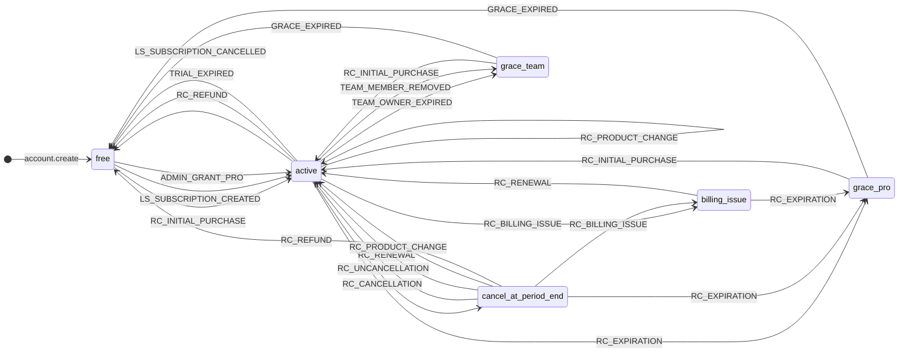

<!-- SHARED: subradar-backend, subradar-web, subradar-mobile -->
<!-- Canonical: subradar-backend/docs/STATE_RULES.md -->
<!-- Synced: 2026-03-07 -->

# SubRadar AI — State Rules

## Subscription Status Lifecycle

```
        ┌──────────────────────────────────────┐
        │                                      v
    TRIAL ──(trial expires)──> ACTIVE ──(pause)──> PAUSED
        │                        │                   │
        │                        │                   │
        v                        v                   v
    CANCELLED <──(cancel)──── ACTIVE <──(resume)── PAUSED
        │
        v
    ARCHIVED
```

### Status Rules

| Status | nextBillingDate | In forecast | Reminders | In main list | Notes |
|--------|----------------|-------------|-----------|-------------|-------|
| TRIAL | No (uses trialEndDate) | Yes (after trial) | Trial expiry | Yes | Has trialEndDate |
| ACTIVE | Yes | Yes | Billing reminders | Yes | Main working state |
| PAUSED | Frozen | No | No | Yes | User temporarily paused |
| CANCELLED | No | No | No | Yes | User cancelled |
| ARCHIVED | No | No | No | No (history only) | Soft-deleted from view |

### Transitions

- **TRIAL -> ACTIVE**: When trial period expires and user doesn't cancel
- **TRIAL -> CANCELLED**: User cancels during trial
- **ACTIVE -> PAUSED**: User pauses subscription
- **ACTIVE -> CANCELLED**: User cancels subscription
- **PAUSED -> ACTIVE**: User resumes subscription
- **Any -> ARCHIVED**: User archives (removes from main list, keeps in history)

## User Billing State Machine

The `user_billing.billingStatus` column is owned by a finite-state machine.
Every transition runs through `UserBillingRepository.applyTransition(userId, event)`
— the only call site allowed to write `plan` / `billingStatus` / `billingSource` /
`billingPeriod` / `currentPeriodStart` / `currentPeriodEnd` / `cancelAtPeriodEnd` /
`gracePeriodEnd` / `gracePeriodReason` / `billingIssueAt`.

Reducer source: [`src/billing/state-machine/transitions.ts`](../src/billing/state-machine/transitions.ts).
Event types: [`src/billing/state-machine/types.ts`](../src/billing/state-machine/types.ts).

### Diagram



### State definitions

| State | Meaning | Access |
|---|---|---|
| `free` | No paid plan | Free tier limits |
| `active` | Paid + auto-renewing (RC / LS / admin grant) | Full plan access |
| `cancel_at_period_end` | User asked to cancel; access until `currentPeriodEnd` | Full plan access |
| `billing_issue` | Apple / LS reported a billing problem (expired card, etc.) | Full plan access (~16 day Apple grace) |
| `grace_pro` | Pro sub expired; 7-day grace before downgrade | Full plan access |
| `grace_team` | Team owner's sub expired (or member removed); 7-day grace | Full plan access |

### Invariants (DB-enforced via CHECK constraints)

1. `state='free'` ⇔ `plan='free'`
2. `state='cancel_at_period_end'` ⇔ `cancelAtPeriodEnd=true` (except `billing_issue`, exempt)
3. `state IN ('grace_pro','grace_team')` ⇒ `gracePeriodEnd IS NOT NULL`
4. `state ∉ ('free','grace_*','billing_issue')` ⇒ `currentPeriodEnd IS NOT NULL` (except admin grants)
5. `state != 'free'` ⇒ `billingSource IS NOT NULL` (except admin grants)

Admin grants (`ADMIN_GRANT_PRO`) are the documented exception — they have no
billing source and no period because access was granted by the system, not bought.

### Event sources

| Event | Fired by |
|---|---|
| `RC_*` | RevenueCat webhook ↦ `mapRCEventToBillingEvent` ↦ `processRevenueCatEvent` |
| `LS_*` | Lemon Squeezy webhook ↦ `mapLSEventToBillingEvent` ↦ `processLemonSqueezyEvent` |
| `TRIAL_EXPIRED` | `RemindersService.expireTrials` cron + `TrialCheckerCron.downgradeExpiredTrials` cron + user-cancel of legacy plans |
| `ADMIN_GRANT_PRO` | `BillingService.activateProInvite` (Pro-invite seat grant) |
| `TEAM_OWNER_EXPIRED` | Cascade from `processRevenueCatEvent` when `RC_EXPIRATION` hits a team owner |
| `TEAM_MEMBER_REMOVED` | `WorkspaceService.removeMember` / `leaveWorkspace` |
| `GRACE_EXPIRED` | `GracePeriodCron.resetExpiredGrace` (daily 00:05 UTC) |
| `RC_CANCELLATION` (synthetic) | Mobile-initiated `cancelSubscription` re-uses this event |

### Failure modes

| Situation | Outcome |
|---|---|
| Reducer throws `InvalidTransitionError` | Caller gets `{ applied: false, reason: 'invalid_transition' }`. Row appended to `billing_dead_letter` table + Telegram alert. Webhook is **not** retried (RC keeps idempotency). |
| Reducer returns identical snapshot | `{ applied: false, reason: 'idempotent_noop' }`. No DB write, no audit row. |
| Concurrent webhook + reconcile on same user | `SELECT … FOR UPDATE` on the `user_billing` row serialises them. Loser usually no-ops. |

## Screen States

Every screen in the app must handle these states:

### 1. Loading
- Show skeleton/shimmer, not blank screen
- Keep navigation accessible

### 2. Empty
- **Never show a "dead" empty screen**
- Empty state must sell the next action:
  - Add a subscription
  - Enable notifications
  - Try AI
  - Upgrade to Pro

### 3. Error
- Show retry button
- Show fallback action (e.g., "Continue to sign in")
- Don't hide quick actions on error

### 4. Success
- Confirmation feedback (toast, animation)
- Clear next step

### 5. Partial data
- If only 1-2 subscriptions: show simplified cards, don't overload with charts
- Encourage adding more data

## Empty State Philosophy

If there's no data, the screen should not be "dead." It must lead the user forward:

| Screen | Empty state action |
|--------|-------------------|
| Home | "Add your first subscription" with 3 CTAs (manual, AI, photo) |
| Subscriptions | "No subscriptions yet" + Add button |
| Analytics | "Add subscriptions to see analytics" |
| Reports | "Generate your first report" |
| Cards | "Add a payment card" |
| Trials | "No active trials" + explain trial tracking |

## Error Handling Principles

1. AI errors must never break the add subscription flow
2. Network errors show retry + offline cache fallback
3. Backend errors show user-friendly message, not raw error
4. Failed PDF generation shows retry option
5. Failed AI parsing offers manual entry
